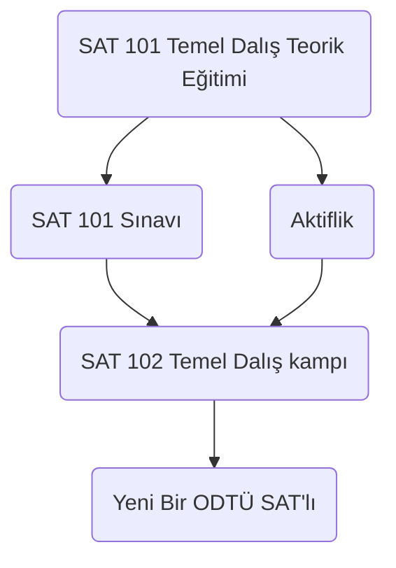

# ODTÜ Su Altı Topluluğu
Yaşantısında denizin hiçbir etkisinin bulunmadığı bir kent ve bu kadar güçlü deniz sevgisine sahip insanlar... 1985 yılında üç ODTÜ’lü öğrenci, üniversite öğrencisinin hareket ve canlılığını, deneyimlerin getirdiği bilinç ve eğitim ile bütünleştirmeyi amaçlayarak hiç gerçekleşmeyecek gibi görünen hayallerine üç akademisyeni de ortak ederek bu topluluğu kurdular. ODTÜ SAT 35. yılında özenle eğitilmiş yüzlerce dalgıcıyla ve ilk günkü heyecanıyla yoluna devam etmektedir.

## Amacımız

Amacımız Türkiye Kıyıları ve iç sularındaki tarihi, kültürel ve doğal değerlerin araştırılması, korunması ve tanıtılmasıdır. Bu kapsamında yapılan çalışmalar arasında temel ve ileri dalış, arama, çıkarma ve ilk yardım eğitimleri vererek topluluk üyelerine bilgi ve beceri kazandırmak; keşif ve inceleme amaçlı çalışmalar için dalıcılar yetiştirmek; kıyılarımız ve iç sularımızdaki ekolojik değerler, doğal değerler, kültürel değerler  gibi konularda araştırmalar ve tanıtım amaçlı (yarışmalar, paneller, toplantılar, seminerler gibi) etkinlikler düzenlemek yer almaktadır.

## Alt Gruplarımız

- Akdeniz Fokları Araştırma Grubu (AFAG)
- Batık Araştırmaları Grubu (BAG)
- Ekoloji Araştırma Grubu (EKOG)
- Fotografi -Videografi Grubu (FOVAG)
- Mağara Dalışı ve Araştırmaları Grubu (MADAG)
- Serbest Dalış Grubu (SDG)
- Sualtı Teknolojisi Araştırma Grubu (TEKNOG)

## Üyelik Sistemi

## İletişim
[Web Sitemiz](http://sat.metu.edu.tr/)
[Instagram](https://www.instagram.com/odtusat/?hl=tr)
[Facebook](https://www.facebook.com/odtusat/)
*sat-yk@metu.edu.tr*

